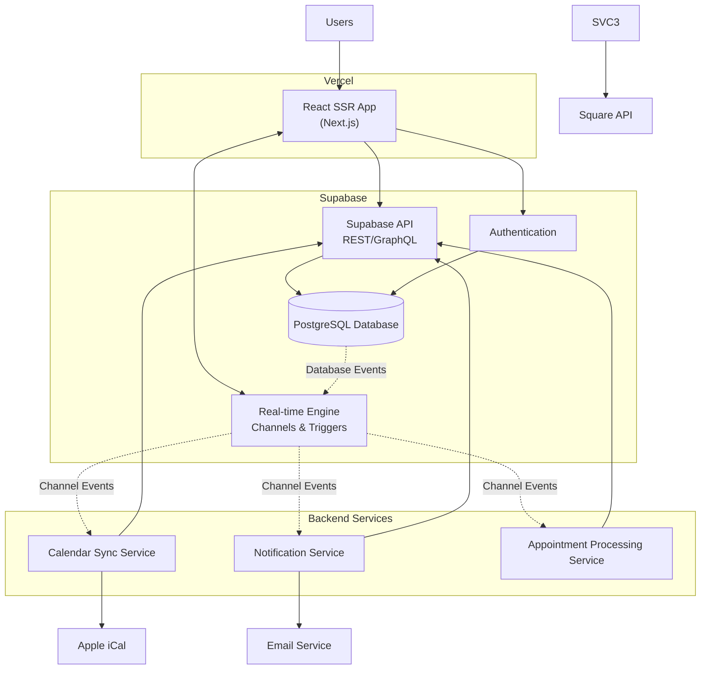

# Architecture

## Architecture Overview

- **Frontend**: Server-side rendered React app hosted on Vercel
- **Backend**: Supabase providing database, real-time channels, and API
- **Services**: Event-driven microservices listening to database changes via Supabase channels
- **Integrations**: External services for calendar sync, payments, and notifications
